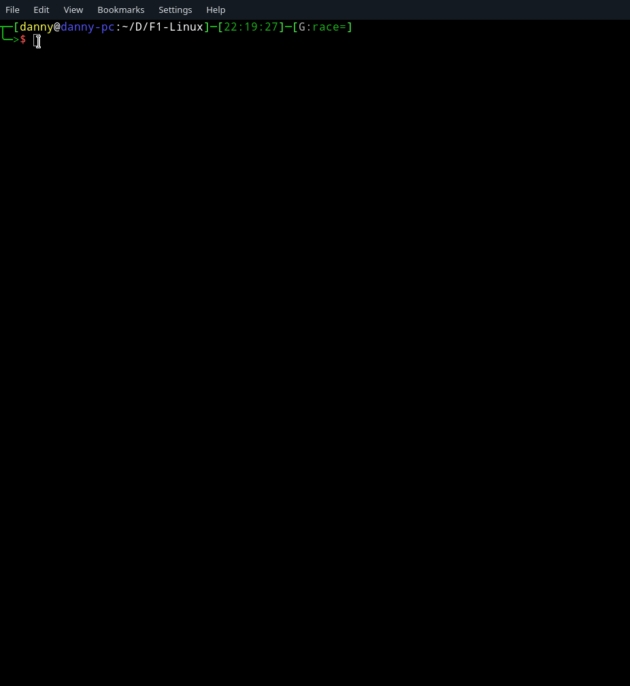

[](https://GitHub.com/Naereen/StrapDown.js/graphs/commit-activity)
[](https://github.com/danny00747/FormulaOne/settings/collaboration)
[](https://confluence.jetbrains.com/display/ALL/JetBrains+on+GitHub)
[](https://www.gnu.org/licenses/gpl-3.0)


# FormulaOne

This a project of the lesson Operating Systems. (Unix) 2nd Bachelor at EPHEC 



## Group

:point_right: Number : 4

:point_right: Authors :

1. **Daniel Olivier** ([@danny00747](https://github.com/danny00747 "danny00747"))
2. **Martin Michotte** ([@MMichotte](https://github.com/MMichotte "Martin Michotte"))
3. **Morgan Valentin** ([@momo007dev](https://github.com/momo007dev "Morgan Valentin"))
4. Others will be added later... 

## How to compile this program

`make`

## How to run this program

`./prog` followed by `--day` with it's value option `sat` for example. And `--step` 
 with it's value to specify which step that needs to be runned `Q1` for instance. 
 For race the user has the option to specify the lap `--length`, 
 by default it's 7Km. The length command is optional. 

>P1/P2/P3 for warmup
>>
>>``` ./prog --day fri --step P2 ```

>Q1/Q2/Q3 : for qualifications
>>
>>``` ./prog --day sat --step Q1 ```

>RACE : for the race.
>>
>>``` ./prog --day sun --step RACE --length 10 ```


## Built With

> [IntelliJ IDEA Community Edition](https://www.jetbrains.com/clion/) - A cross-platform IDE for C and C++

## Tâches à faire

- [x] Création du GitHub
- [x] Création d'un randomizer pour générer un temps
- [x] Création d'un affichage temporaire pour tester des parties du code
- [x] Réutilisation du randomizer pour la gestion des secteurs, tours et des crashs
- [x] Création de l'affichage final
- [x] Triage de l'affichage
- [x] Création des forks et attribuer à chaque véhicule une structure par défaut
- [x] Gestion de la compétition en 3 parties au niveau des séances d'essais libres
- [x] Gestion de la compétition en 3 parties au niveau des qualifications
- [x] Gestion de la compétition lors de la course, du grand prix

## Cahier des charges du projet

### Projet OS Octobre 2019

Le but du projet est de gérer un week-end complet d’un grand prix de Formule 1, depuis les séances d’essais du vendredi jusqu’à la course du dimanche, en passant par les essais du samedi et la séance de qualifications.

Il y a 20 voitures engagées dans un grand prix.
Leurs numéros sont : 44, 77, 5, 7, 3, 33, 11, 31, 18, 35, 27, 55, 10, 28, 8, 20, 2, 14, 9, 16.

Un circuit de F1 est divisé en 3 secteurs (S1, S2, S3).

Le calendrier d’un week-end de F1 est établi comme suit :

- Vendredi matin, une séance d’essais libres d’1h30 (P1)
- Vendredi après-midi, une séance d’essais libres d’1h30 (P2)
- Samedi matin, une séance d’essais libres d’1h (P3)
- Samedi après-midi, la séance de qualifications, divisée en 3 parties :
  - Q1, durée 18 minutes, qui élimine les 5 dernières voitures (qui occuperont les places 16 à 20 sur la grille de départ de la course)
  - Q2, durée 15 minutes, qui élimine les 6 voitures suivantes (qui occuperont les places 11 à 16 sur la grille de départ de la course)
  - Q3, durée 12 minutes, qui permet de classer les 10 voitures restantes pour établir les 10 premières places sur la grille de départ de la course
- Dimanche après-midi, la course en elle-même.

Votre projet devra prendre en charge les choses suivantes.

#### Première partie : gestion des séances d’essai, des qualifications et de la course

##### Lors des séances d’essais (P1, P2, P3) :

- [x] Relever les temps dans les 3 secteurs à chaque passage pour chaque voiture
- [x] Toujours savoir qui a le meilleur temps dans chacun des secteurs
- [x] Classer les voitures en fonction de leur tour complet le plus rapide
- [x] Savoir si une voiture est aux stands (P)
- [x] Savoir si une voiture est out (abandon de la séance)
- [x] Dans ces 2 derniers cas, on conserve toujours le meilleur temps de la voiture et celle-ci reste dans le classement
- [x] Conserver le classement final à la fin de la séance

##### Lors des qualifications (Q1, Q2, Q3) :

- [x] Relever les temps dans les 3 secteurs à chaque passage pour chaque voiture
- [x] Toujours savoir qui a le meilleur temps dans chacun des secteurs
- [x] Classer les voitures en fonction de leur tour complet le plus rapide
- [x] Savoir si une voiture est aux stands (P)
- [x] Savoir si une voitures est out (abandon de la séance)
- [ ] Dans ces 2 derniers cas, on conserve toujours le meilleur temps de la voiture et celle-ci reste dans le classement
- [x] A la fin de Q1, il reste 15 voitures qualifiées pour Q2 et les 5 dernières sont placées à la fin de la grille de départ (places 16 à 20)
- [x] A la fin de Q2, il reste 10 voitures qualifiées pour Q3 et les 5 dernières sont placées dans les places 11 à 15 de la grille de départ
- [x] Le classement de Q3 attribue les places 1 à 10 de la grille de départ
- [x] Conserver le classement final à la fin des 3 séances (ce sera l’ordre de départ pour la course)

##### Lors de la course :

- [x] Le premier classement est l’ordre sur la grille de départ
- [x] Le classement doit toujours être maintenu tout au long de la course (gérer les dépassements)
- [x] Relever les temps dans les 3 secteurs à chaque passage pour chaque voiture
- [x] Toujours savoir qui a le meilleur temps dans chacun des secteurs
- [x] Toujours savoir qui a le tour le plus rapide
- [ ] Savoir si la voiture est out (abandon) ; dans ce cas, elle sera classée en fin de classement
- [x] Savoir si la voiture est aux stands (PIT), gérer le temps aux stands et faire ressortir la voiture à sa place dans la course (généralement 2 ou 3 PIT par voitures)
- [x] Conserver le classement final et le tour le plus rapide

**_Remarque :_ les stands se trouvent toujours dans le secteur 3.**

De plus, il vous est demandé de paramétrer votre programme.

En effet, les circuits peuvent être de longueur très variable et, dès lors le nombre de tours pour la course varie également (on essaie que le nombre total de kilomètres soit toujours plus ou moins le même pour chacune des courses du calendrier).

##### On vous demande de :

- [x] Réaliser le programme en C sous Linux
- [x] Utiliser la mémoire partagée comme moyen de communication inter-processus
- [x] Utiliser les sémaphores pour synchroniser l’accès à la mémoire partagée

Bon courage. :+1:

## Licence & Copyright

> GNU General Public License v3.0

This project is licensed under the GNU General Public License v3.0 - see the [LICENSE](LICENSE) file for details.

© Daniel Olivier, EPHEC Louvain-la-Neuve


